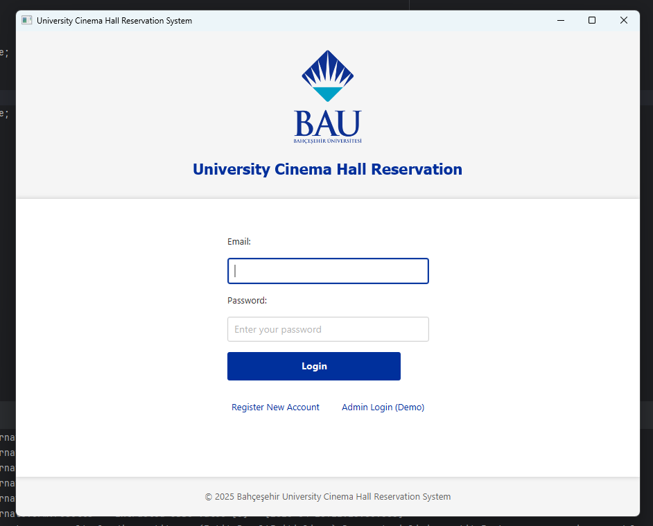
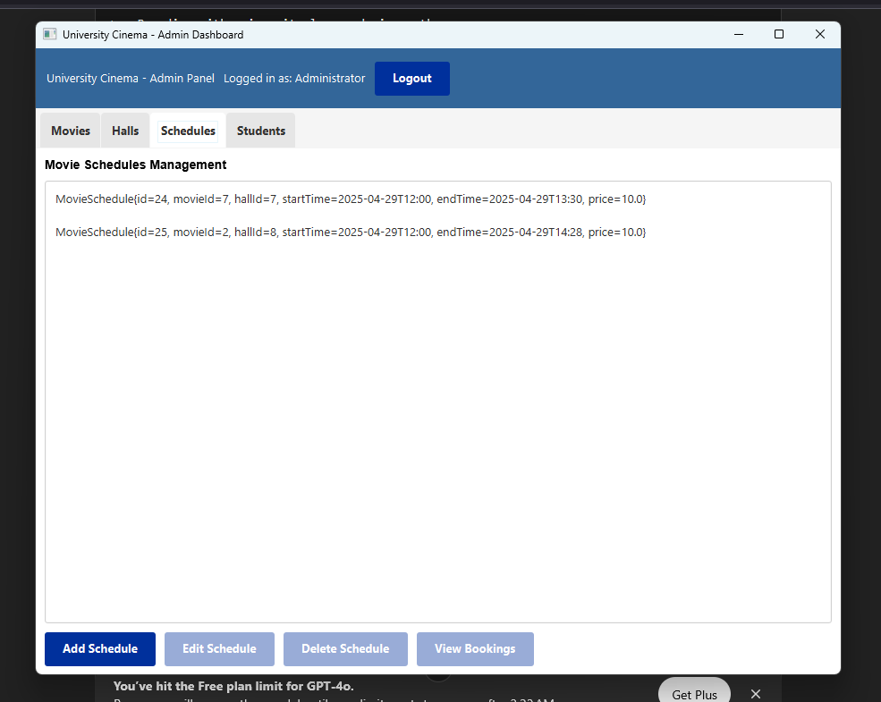
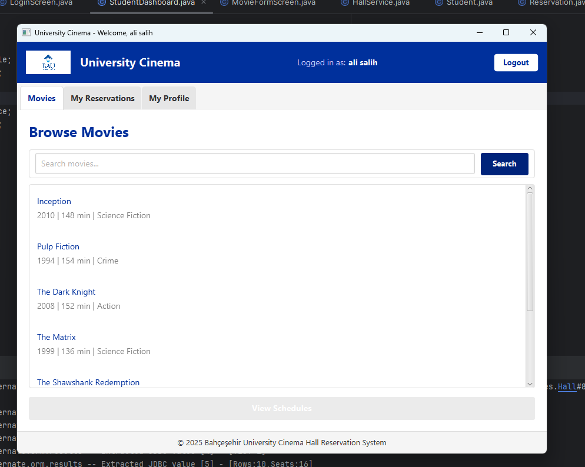
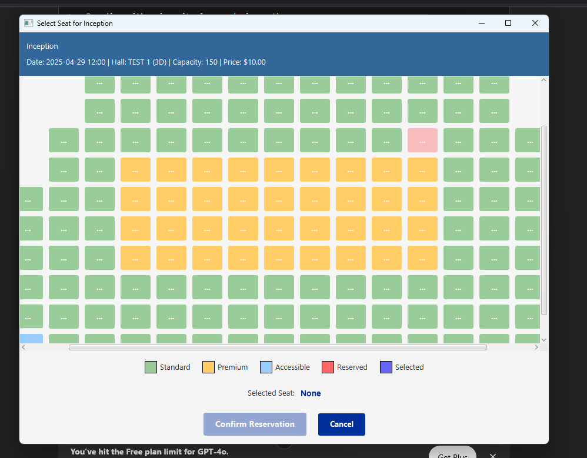

# 🎬 University Cinema Hall Reservation System

A JavaFX-based desktop application that allows students to browse movies, view schedules, and reserve cinema seats inside the university. Admins can manage movie schedules and hall details. Designed with a modern UI and full MVC architecture.

---
# Movie Reservation System

## 🎥 Overview
A web-based movie reservation system where students can browse movies, check showtimes, and reserve seats. Admins can schedule movies and manage showtimes.

---

## 📸 Screenshots

### 1. Login / Demo Admin Access



> This screen allows users to log in with student credentials or enter as a demo admin.  
> Key features:
> - Secure login form
> - "Login as Demo Admin" option
> - Branding with university logo and cinema theme

---

### 2. Admin View: Movie Scheduling



> Admin panel for scheduling movies and managing showtimes.  
> Key features:
> - Dropdowns to select movies and halls
> - Time and date pickers
> - Seat layout configuration
> - Confirmation and error feedback messages

---

### 3. Student Dashboard – Browse & Reserve



> Student interface to browse movies and make reservations.  
> Key features:
> - Filterable movie list
> - Showtimes per movie
> - Reservation system with real-time availability
> - Tabs for Movies, Reservations, and Profile

---

### 4. Select Seats – Movie Reservation



> Seat selection interface for movie reservations.  
> Key features:
> - Dynamic seat grid based on theater layout
> - Available, selected, and occupied seat colors
> - Real-time seat availability updates
> - Confirmation popup when seats are selected
> - Option to deselect or change selected seats

---
---

## 🚀 Getting Started

### 🧾 Requirements

- Java 11+
- JavaFX 17+
- Maven

### 📦 Clone and Run

```bash
git clone https://github.com/your-username/university-cinema.git
```
```bash
cd university-cinema
```
```bash
mvn javafx:run
```


# 🎬 University Cinema Hall Reservation System – Architecture Overview

## 📐 Main Architecture Patterns

The **University Cinema Hall Reservation System** follows a layered and modular software architecture built primarily on the following patterns:

- **Model-View-Controller (MVC)**
- **Service Layer**
- **Factory Pattern**
- **DAO (Data Access Object) Pattern**
- **Singleton Pattern (implicit usage)**

---

## 🧩 MVC Pattern

The **MVC (Model-View-Controller)** pattern structures the application into three core components:

- **Model**  
  Located in `com.ucinema.model.entities`, this package includes business entities such as:
  - `Movie`
  - `Student`
  - `Reservation`
  - `Hall`

- **View**  
  Found in `com.ucinema.view`, this package includes JavaFX-based UI components such as:
  - `LoginScreen`
  - `StudentDashboard`
  - Tabbed panes for Movies, Reservations, and Profile

- **Controller (via Services)**  
  Service classes act as the controller layer:
  - Handle interactions between the view and the model
  - Enforce business rules and logic
  - Examples: `ReservationService`, `MovieService`, `HallService`

---

## 🧪 Service Layer Pattern

Business logic is encapsulated in a **Service Layer** that:

- Mediates between the UI and data access layers
- Provides clean APIs for operations like:
  - Searching movies
  - Reserving seats
  - Managing user profiles
- Delegates database interactions to the DAO layer

---

## 🏭 Factory Pattern

A clear implementation of the **Factory Pattern** is found in the **HallService** class:

- **Hall Creation**
  - `addHall()` creates `Hall` objects based on standardized layouts
  - Handles logic for mapping custom capacities to nearest standard sizes

- **Seat Factory**
  - `createSeatsForHall()` builds seat arrangements dynamically
  - Supports multiple seat types (standard, premium, accessible)
  - Applies rules for layout formatting (e.g., center aisles)

- **Layout Mapping**
  - Uses `STANDARD_LAYOUTS` as a configuration map
  - Ensures layout consistency and scalability

---

## 🗃 DAO Pattern

The **DAO (Data Access Object)** pattern is implemented via classes like:

- `MovieDAO`
- `ReservationDAO`
- `StudentDAO`

These classes abstract all database access logic, promoting:

- Loose coupling
- Maintainability
- Easy testing and mocking

---

## ♻️ Singleton Pattern (Implicit)

Service classes behave as **singletons**:

- Only one instance per service is expected at runtime
- Ensures consistency and shared state across the app
- Could be explicitly managed using dependency injection in future iterations

---

## 📊 Custom Data Structures

The system utilizes domain-specific data structures to enhance performance:

| Structure               | Purpose                                               |
|-------------------------|-------------------------------------------------------|
| `HallGraph`             | Models seat adjacency/relationships as a graph        |
| `ReservationLinkedList` | Dynamic reservation management via linked list        |
| `ScheduleBST`           | Efficient movie schedule lookup (binary search tree)  |
| `StudentHashTable`      | Fast access to student data via hashing               |

These choices reflect a focus on optimizing for the system’s specific performance needs.

---

## ✅ Summary

The system demonstrates strong software architecture through:

- Separation of concerns via MVC
- Well-defined service and data access layers
- Efficient object creation using the Factory Pattern
- Performance-oriented use of custom data structures

This architecture enables modularity, maintainability, and scalability — ideal for an academic or production-level cinema reservation system.

---
